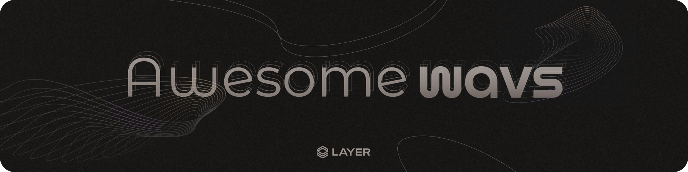

# Awesome WAVS

 

A curated list of awesome resources for building with WAVS: The WASI-AVS runtime.

## About 🌊

- [Docs](https://docs.wavs.xyz/) - Official documentation.
- [WAVS Overview](https://docs.wavs.xyz/overview) - Learn about WAVS.
- [How WAVS Works](https://docs.wavs.xyz/how-it-works) - An in-depth look at WAVS.
- [What Is WAVS?](https://www.layer.xyz/news-and-insights/what-is-wavs-framework-avs-layer) - A blog post introducing WAVS.
- [WAVS Design Considerations](https://docs.wavs.xyz/design) - Learn what WAVS is best suited for.

## Start Building 🏁

- [WAVS Tutorial](https://docs.wavs.xyz/tutorial/1-overview) - Build a demo oracle service in less than 5 minutes.
- [WAVS Template](https://github.com/Lay3rLabs/wavs-foundry-template) - A Foundry template for building with WAVS.
- [WAVS Component Handbook](https://docs.wavs.xyz/custom-components) - Everything you need to know to build a custom service.

- [WAVS Utils](https://github.com/Lay3rLabs/wavs-wasi%20): WASI utils and WIT interfaces.  
- [WAVS Middleware](https://github.com/Lay3rLabs/wavs-middleware): Solidity contracts interfacing with Eigenlayer and more.  
- [Climb](https://github.com/Lay3rLabs/climb): A Rust client for interacting with chains.
- [`wavs-types`](https://docs.rs/wavs-types/0.3.0-alpha5/wavs_types/index.html) - Crate docs defining core data structures and types used for building and interacting with components and services.
- [WAVS-WASI-Chain](https://docs.rs/wavs-wasi-chain/latest/wavs_wasi_chain/index.html) - Crate docs with a set of helpful functions for making HTTP requests, interacting with the blockchain, and decoding trigger data for use in the component.
- [WAVS Solidity Interfaces](https://www.npmjs.com/package/@wavs/solidity?activeTab=code) - The NPM package code with contract interfaces.

## Videos 📺

- [Layer Labs Youtube channel](https://www.youtube.com/@Layer_Labs)
- [Infinite Layers - Simplifying EigenLayer Development with WAVS](https://www.youtube.com/watch?v=54wzvxoKUs)
- [WAVS Prediction Market Demo](https://www.youtube.com/watch?v=BT0CjXCJhbY)
- [Wavs Tutorial Walkthrough v0.3.0](https://www.youtube.com/watch?v=X3XCbSF9Epc)
- [Build an AVS in 1 prompt with WAVS](https://www.youtube.com/watch?v=jyl7kbie41w)
- [Build an EigenLayer Service in 13 minutes - With Nader (@dabit3)](https://x.com/dabit3/status/1909805584473268646)
- [What is WAVS? - With Nader (@dabit3)](https://x.com/dabit3/status/1909805584473268646)
- [Launch your first AVS in 13 minutes with WAVS - Coordinated podcast](https://www.youtube.com/watch?v=l6MgEziWo-I)

## WAVS Examples 😎

- [Dynamic NFTs](https://github.com/Lay3rLabs/wavs-nft): NFTs that can leverage WAVS for generative art or dynamically update themselves based on events.  
- [Multichain example](https://github.com/Lay3rLabs/wavs-multichain-example): An example showcasing multichain interactions.  
- [Hats Protocol AVS](https://github.com/Lay3rLabs/wavs-hats): Hats Protocol modules that can interact with WAVS to toggle, mint, create, or control eligibility for roles and permissions.  
- [Telegram Bot](https://github.com/Lay3rLabs/example-telegram-bot): Onchain events triggering telegram messages.  
- [Prediction Market](https://github.com/Lay3rLabs/wavs-demos/blob/main/demos/PREDICTION_MARKET_DEMO.md): Use WAVS as the market resolver for prediction markets.  
- [AI Controlled Safe](https://github.com/Lay3rLabs/wavs-demos/blob/main/demos/SAFE_AI_MODULE_DEMO.md): A Safe custom module controlled by a deterministic LLM.  
- [WAVS Safe Guard](https://github.com/Lay3rLabs/wavs-demos/blob/main/demos/SAFE_GUARD_DEMO.md): A Safe Guard that can leverage off-chain checks to determine whether a transaction can be performed.  
- [Cosmos \-\> Eth Bridge](https://github.com/Lay3rLabs/example-telegram-bot): A non-production example of a Cosmos to Ethereum bridge.

## Rust 🦀

- [Rust language cheat sheet](https://cheats.rs/) - A cheat sheet for those new to Rust.
- [Let's Get Rusty cheat sheet](https://archive.org/details/lgr-cheat-sheet) - A book-style cheat sheet.
- [Learn Rust](https://www.rust-lang.org/learn) - Resources for learning Rust.
- [Rust book](https://doc.rust-lang.org/book/) - an overview of the language from first principles.

## WASM/WASI 🕸️

- [webassembly.org](https://webassembly.org/) - Learn about WASM.
- [wasi.dev](https://wasi.dev/) - All about the WebAssembly System Interface.
- [WebAssembly Component Model](https://component-model.bytecodealliance.org/) - Learn about the component model.
- [cargo-component](https://github.com/bytecodealliance/cargo-component) - A cargo subcommand for building WebAssembly components. 
- [WAC (WebAssembly Composition)](https://github.com/bytecodealliance/wac) - A tool for composing WebAssembly components together.
- [componentize-py](https://github.com/bytecodealliance/componentize-py) - Convert a Python app to a WebAssembly component.
- [ComponentizeJS](https://github.com/bytecodealliance/ComponentizeJS) - Convert JavaScript source code to a WebAssembly component.

## AVS Resources 📚

- [Awesome AVS](https://github.com/Layr-Labs/awesome-avs) - Awesome resources for AVS builders.
- [You Could've Invented EigenLayer](https://www.blog.eigenlayer.xyz/ycie/) - An easy intro to EigenLayer.
- [EigenLayer Docs](https://docs.eigenlayer.xyz/) - Learn all about EigenLayer services and restaking.
